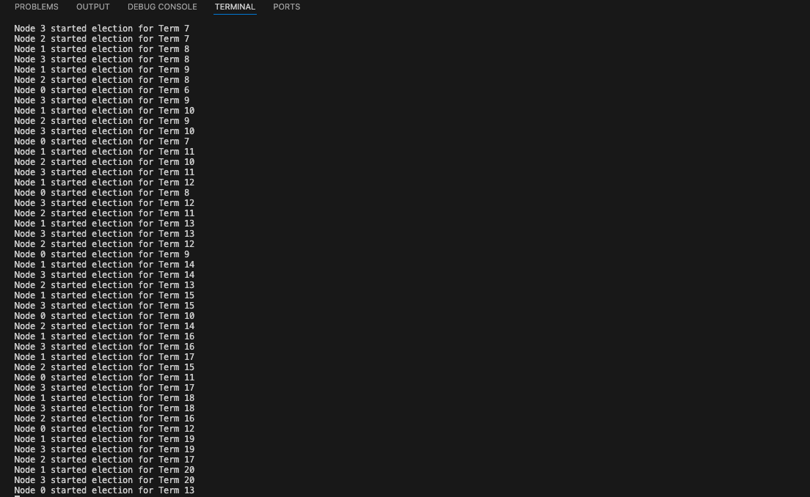

# BiniBFT Consensus Simulation (Raft-inspired in Go)

A basic consensus algorithm implemented in Go, simulating a Raft-style cluster of nodes achieving agreement on operations with leader election, fault tolerance, and state logging.

---

## 🚀 Project Goals

- Simulate a **Raft-style consensus** mechanism in Go
- Handle **leader election**, **log agreement**, and **node failures**
- Demonstrate **fault tolerance** and **state updates** clearly via logs

---

## 🧱 Architecture Overview

### Nodes
- Each node runs as a **goroutine**
- Maintains `CurrentTerm`, `VotedFor`, `Log[]`, and `State` (Leader/Follower/Candidate)

### Communication
- Nodes communicate via **Go channels** (simulated network)
- Messages include: `RequestVote`, `Vote`, `AppendEntry`, `Ack`, and `Heartbeat`

### Leader Election
- Based on randomized election timeout
- Candidate requests votes from peers
- On receiving majority votes, becomes Leader

### Consensus
- Leader sends `AppendEntry` to followers
- Followers append log entries and send back `Ack`

---

## 🔧 How to Run

### Requirements

- Go 1.20+

### Clone & Run
```bash
git clone https://github.com/yourusername/bini-consensus
cd bini-consensus
go run main.go


## 🖼️ Terminal Output Screenshot

Here is a screenshot showing sample output of leader election and log replication:


